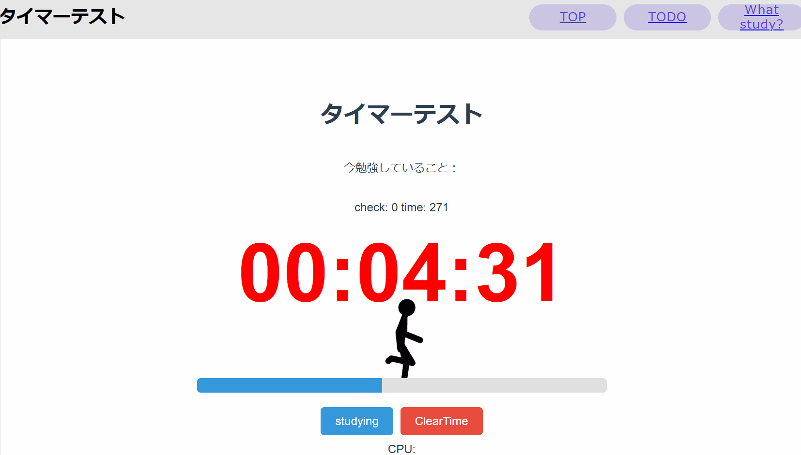

> [!WARNING]
> このプロジェクトは開発途中です。
> 何かしら不具合があると思います。

# SynClock

勉強などに使用することを目的としているwebタイマーです。

## Function

- **Timer**: webページを開くだけで使用できるタイマーです。
- **Progress Bar**: １０分おきにプログレスバーがリセットされ、ポイントが加算れていきます。
- **TODO MODE**: TODOを保存できます。
- **Clear Button**: タイマーをリセットできます。
- **REST TIME**: 休憩を取ることも可能です。

## Demo

### 製品版
[https://clockshare-f8b57.web.app](https://clockshare-f8b57.web.app)

### 開発版
[https://2k2e2n.github.io/ClockShare_React/](https://2k2e2n.github.io/ClockShare_React/)


## Getting Started

### Prerequisites

- Node.js
- yarn

### Installation

1. Clone the repository:

    ```bash
    git clone https://github.com/2k2e2n/ClockShare_React.git
    ```

2. Navigate to the project directory:

    ```bash
    cd ClockShare_React
    ```

3. Install the dependencies:


    ```bash
    yarn install
    ```

### Running the Application

To start the development server, run:

```bash
yarn run dev
```

### deploy firebase server

```bash
firebase deploy
```